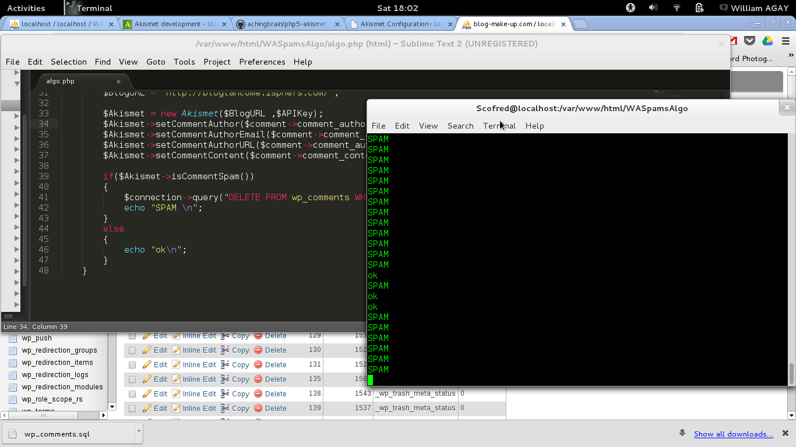

What is it ?
============

This script check each comments of your wp_comments table of the Wordpress install to detect if it's a spam.

You can easely use this script for other systems. Not only Wordpress

How it's works ?
----------------

- Set you database informations (wordpress database)
- Set your wordpress url & your Akismet API key
- launch the script in comand line.

It will check every comments with the Akismet API and delete the comment if it's a spam in wp_comments et wp_commentmeta. Else, the comment stay in the db.

License
-------

MIT, read LICENSE.md